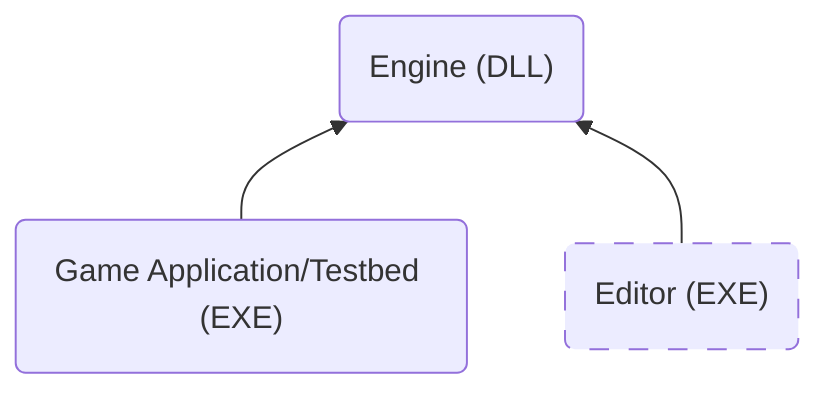

Welcome to the documentation of Kiwi Engine, a 3D game engine and learning project.

This documentation serves two purposes. First, it helps me quickly recall the structure and design of systems I haven’t worked on in a while. Second, it functions as regular technical documentation for the engine.

Since this is a solo, learning-focused project, I prioritize clarity and context over brevity. Some sections may go deeper into implementation details than strictly necessary to fully document design decisions and internal behavior.

> [!warning]
> Most of the pages linked here are still work in progress and not yet available!

# Platforms and Compilers Support
The only platform currently supported is Windows. The main focus of the project is the technology itself, portability and support for additional platforms may come at some point in the development as an exercise. However, the [[Windows Platform Layer | platform layer]] is self contained and accessed through a unified API, making it invisible to the rest of the engine.

The primary compiler supported is MSVC with permissive mode disabled in order to enforce standards-conforming compiler behavior and improve code portability. Support for additional compilers will be introduced later to allow performance comparisons and tests. See the [[Build System]] page for details and step-by-step instructions for building the entire project.

# High Level Engine Architecture
The engine is built as a DLL (or multiple DLLs later in development) that the game application (`.exe`) links against. The repository includes a dummy game called Testbed, used to test each feature as the engine evolves.

Later in development, an editor application will be added. This is intended to run alongside the game and will link against the engine as well. Keeping the editor separate from the engine core avoids shipping editor code with the game.

For more information on how the game should attach itself to the engine, see [[Entry Point and Game Types]]

# Feature List
The following is a list of features and systems implemented. A complete list of [[tags/class | classes]] is also available.

- **[[Rendering]]:** Rendering system using Vulkan.
- **[[Windows Platform Layer]]:** Provides APIs for windowing, memory allocation, console output and time.

## Core
- **[[Application Layer]]:** Middle layer between the platform and the game.
- **[[Event System]]:** Event firing and receiving across uncoupled systems.
- **[[Input Handling]]:** Platform independent keyboard and mouse input handling.
- **[[Logging]]:** Multiple levels console output logger.
- **[[Memory System]]:** Arena based memory allocation.

## Containers
- **[[Dynamic Array]]**
- **[[Linked List]]** 